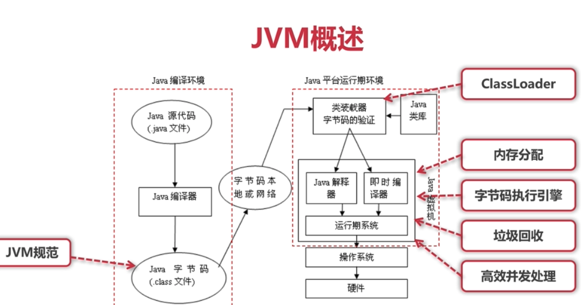
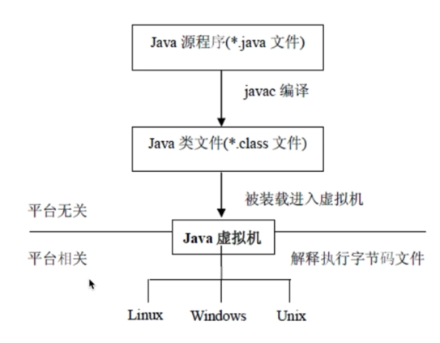

 # JVM概述

- JVM: java virtual Machine, 也就是java 虚拟机
- 所谓虚拟机是指，通过软件模拟的具有完整硬件系统功能的，运行在一个完全隔离环境中的计算机系统
- JVM 是通过软件来模拟JAVA字节码的指令集，是JAVA程序的运行环境

#### JVM 主要功能

1. 通过 ClassLoader 寻找和装载class 文件

2. 解释字节码成为指令并执行，提供class 文件的运行环境

3. 进行运行期间的内存分配和垃圾回收

4. 提供与硬件交互的平台

   #### 虚拟机是Java 与平台无关的保障

   ###  

#### JVM 规范作用

- Java 虚拟机规范为不同平台的硬件平台提供了一个种编译Java 技术代码的规范

- 该规范使java 独立于平台，因为编译是针对作为虚拟机的“一般机器”而做

- 这个“一般机器”可用软件模拟并运行于各种现存的计算机系统，也可以用硬件来实现

  

##### JVM 规范定义的主要内容（配合java 虚拟机指令集）

- 字节码指令集（相当于CPU) 2.11 
- Class 文件格式
- 数据类型和值
- 运行时数据区
- 栈帧
- 特殊方法实现
- 类库
- 异常
- 虚拟机的启动，加载，链接和初始化

## Class字节码解析：理解ClassFile 结构

#### Class 文件格式概述

Class 文件是JVM 的输入，Java 虚拟机规范中定义了Class文件的结果。Class 文件是JVM 实现平台无关，技术无关的基础

1.  class 文件是一组以8字节为单位的字节流，各个数据项目按顺序紧凑排列
2. 对于占用空间大于8个字节的数据项，按照高位在前的方式分割成多个8个字节进行存储
3. class 文件格式只有两种类型：无符号类型，表
   - 无符号数：基本数据类型，以u1, u2, u4, u8 来代表几个字节的无符号数
   - 表：由多个无符号数和其它表构成的复合数据类型，通常以“_info"结尾

