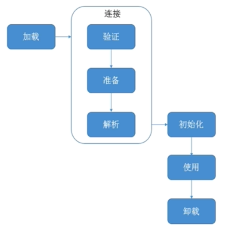

# 类

## 类加载和类加载器

### 类加载，连接和初始化

 #### 概述

类从被加载到JVM 开始，到卸载出内存，如下图：  

- 加载：查找并加载类文件的二进制数据
- 连接：将已经读入内存的类的二进制数据合并到JVM运行时环境中去，包含如下步骤：
  - 验证：确保被加载类的正确性
  - 准备：为类的 静态变量 分配内存，并初始化他们
  - 解析：把常量池中的符号引用转换成直接引用
- 初始化：为类的静态变量准备初始值  

#### 类加载要完成的功能

1. 通过类的全限定名（包+类名）来获取该类的二进制字节流
2.  把二进制字节流转化为方法区的运行时的数据结构
3. 在堆上创建一个java.lang.Class 对象，用来封装类在方法区内的数据结构，并向外提供了访问方法区内数据结构的接口

#### 加载类的方式

- 最常见的方式：本地文件系统中加载，从jar 等归档文件中加载
- 动态方式：将java 源文件动态编译成class  
- 其他方式：网络下载，从专有数据库中加载等等

#### 类加载器 classloader 

Java 虚拟机自带的加载器包括如下几种：

- 启动类加载器( BootstrapClassLoader)
- 平台类加载器(PlatformClassLoader)
- 应用程序类加载器(AppClassLoader)
- JDK8: 扩展类加载器(ExtensionClassLoader)

用户自定义的加载器，是 java.lang.ClassLoader 的子类，用户可以定制类的加载方式；只不过自定义类加载器其加载的顺序是在所有系统类加载器的最后   

### 类加载器的说明

- 启动类加载器：用于加载启动的基础模块类，比如：java.base, java.management, java.xml 等等  
- 平台类加载器:用于加载一些平台相关的模块，比如：java.scripting, java.compiler*, java.corba * ......
- 应用程序类加载器：用于加载应用级别的模块，比如：jdk.compiler, jdk.jartool, jdk.shell 等等；还加载 classpath 路径中的所有类库
- JDK8: 启动类加载器：负责将<JAVA_HOME>/lib, 或者Xbosstclasspath 参数指定的路径中的，且是虚拟机识别的类库加载到内存中
- 